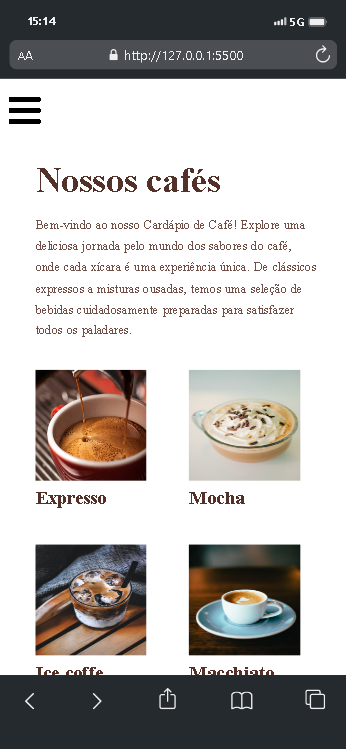

# Random Color Flipper




A coffe menu project created with JavaScript based on Figma layout.

## Features

- Price calculation.
- Quantity counter.
- Background color change to the generated color.
- User-friendly and easy-to-use interface.

## Clone this repository to your local machine:
   ```shell
   git clone https://github.com/Joao-Pereira013/Js-CoffeMenu
   ```
